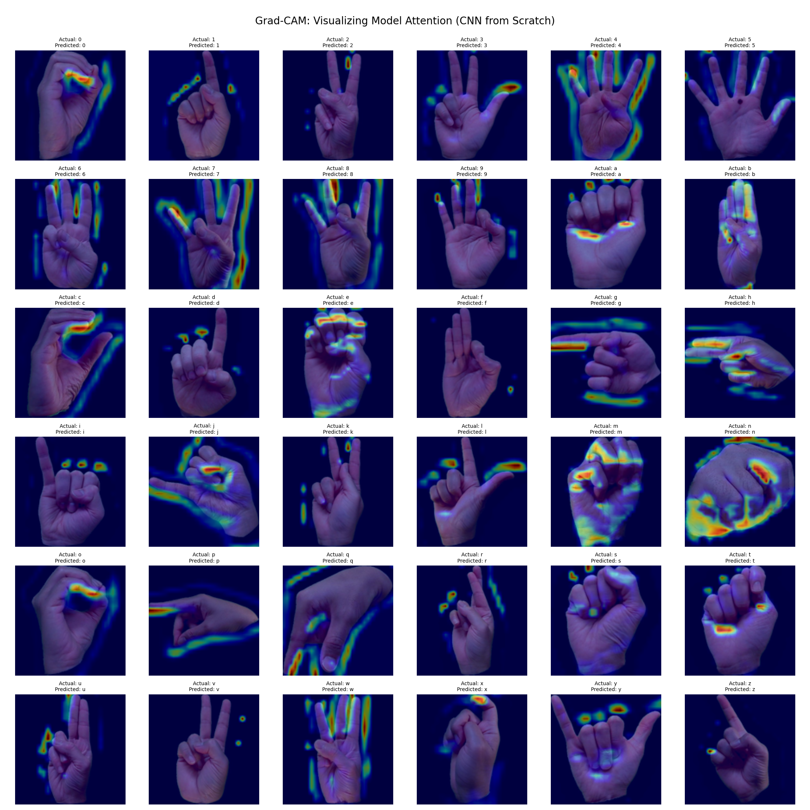

# Computer Vision: American Sign Language Interpreter

## 1. Project Goal
The goal of this project is to build and evaluate a deep learning model capable of interpreting images of American Sign Language (ASL) hand signs. This serves as a practical application of computer vision and demonstrates a complete workflow from data acquisition to model deployment in an interactive web application. The dataset includes signs for the letters A-Z and the numbers 0-9.

## Table of Contents
- [Project Goal](#1-project-goal)
- [Project Workflow](#2-project-workflow)
- [Data Exploration and Preprocessing](#3-data-exploration-and-preprocessing)
- [Modeling: CNN from Scratch vs. Transfer Learning](#4-modeling-cnn-from-scratch-vs-transfer-learning)
- [Model Evaluation](#5-model-evaluation)
- [Model Interpretability with Grad-CAM](#6-model-interpretability-with-grad-cam)
- [Interactive Web Demo](#7-interactive-web-demo)
- [How to Run This Project](#8-how-to-run-this-project)

## 2. Project Workflow
This project follows a structured, end-to-end machine learning lifecycle:

`Data Acquisition -> EDA -> Preprocessing & Augmentation -> Model Training -> Evaluation -> Interpretability -> Web App Deployment`

## 3. Data Exploration and Preprocessing

### 3.1. Dataset
The project utilizes the "American Sign Language Dataset" from Kaggle, which contains thousands of images across 36 classes: the letters A-Z and the numbers 0-9.

### 3.2. Initial Data Analysis
Exploratory Data Analysis (EDA) confirmed that the dataset is well-balanced, with a similar number of images for each class. This is ideal as it prevents the model from being biased towards any particular sign. A sample of the images was visualized to understand the variations in lighting, hand position, and background.

### 3.3. Data Augmentation
To make the model more robust and prevent overfitting, data augmentation techniques were applied during training. These techniques create modified versions of the training images on-the-fly, including:
- **Random Flips:** Horizontally flipping the images.
- **Random Rotations:** Slightly rotating the images.
- **Random Zooms:** Slightly zooming in on the images.

## 4. Modeling: CNN from Scratch vs. Transfer Learning
Two different deep learning approaches were implemented to compare their effectiveness:

1.  **CNN from Scratch:** A custom Convolutional Neural Network (CNN) was built with three convolutional layers followed by max-pooling and dense layers. This approach learns features directly from the ASL dataset.
2.  **Transfer Learning (MobileNetV2):** This approach leverages a powerful, pre-trained model, `MobileNetV2`, which has already learned rich feature representations from the massive ImageNet dataset. The base of this model was frozen, and a new classification head was trained on top to adapt it to the ASL sign recognition task.

## 5. Model Evaluation

### 5.1. Training Performance
Both models were trained using callbacks for `EarlyStopping` and `ModelCheckpoint`. Their accuracy and loss were tracked on the training and validation sets.

**CNN from Scratch:**


**Transfer Learning (MobileNetV2):**


**Conclusion:** The transfer learning model achieved higher accuracy much more quickly and showed less overfitting than the CNN built from scratch. This demonstrates the power of leveraging pre-trained models for computer vision tasks.

### 5.2. Confusion Matrix
A confusion matrix was generated for the best-performing model (MobileNetV2) to analyze its performance on a class-by-class basis.


**Analysis:** The strong diagonal line indicates high accuracy across most classes. The few off-diagonal entries highlight which signs are occasionally confused with each other (e.g., 'm' and 'n', which are visually similar).

## 6. Model Interpretability with Grad-CAM
To understand *what* parts of an image the models are focusing on to make a prediction, the Grad-CAM (Gradient-weighted Class Activation Mapping) technique was used.

**CNN from Scratch Attention:**


**Transfer Learning Attention:**


**Insight:** The heatmaps reveal a significant difference. The CNN from scratch has "noisy" attention, sometimes focusing on irrelevant background details. In contrast, the Transfer Learning model, leveraging its vast prior knowledge, confidently and precisely focuses only on the hand and fingers. This visually confirms why the transfer learning approach is superior.

## 7. Interactive Web Demo
A web application was built using Streamlit to provide an interactive, side-by-side comparison of the two models. Users can upload an image of a hand sign, and the app will display each model's prediction and Grad-CAM visualization in real-time.

## 8. How to Run This Project
1.  **Clone the repository and navigate into the project folder:**
    ```bash
    git clone [https://github.com/manuelbecker123/ML_Projects.git](https://github.com/manuelbecker123/ML_Projects.git)
    cd ML_Projects/asl-interpreter
    ```
2.  **Set up the environment and install dependencies:**
    ```bash
    python3 -m venv venv
    source venv/bin/activate
    pip install -r requirements.txt
    ```
3.  **Run the full training and evaluation pipeline (optional, takes time):**
    ```bash
    python src/train_model.py
    ```
4.  **Launch the Streamlit web application:**
    ```bash
    streamlit run app/app.py
    