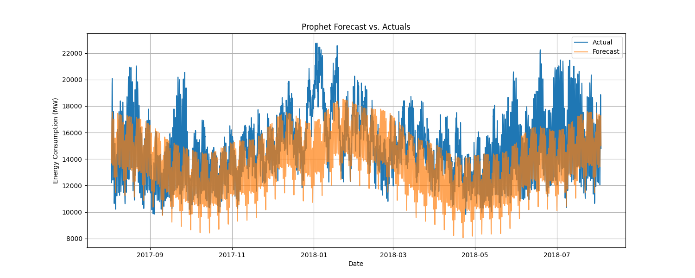

# Machine Learning Project: Hourly Energy Consumption Forecast

## 1. Project Goal
The primary objective of this project is to develop and compare machine learning models to accurately forecast hourly electricity consumption. Using a publicly available dataset for the AEP Ohio service region, this case study follows best practices to build a robust time series forecasting pipeline, evaluating both a classical statistical model and a deep learning approach to determine the most effective solution.

## Table of Contents
- [Project Goal](#1-project-goal)
- [Project Workflow](#2-project-workflow)
- [Data Exploration and Preprocessing](#3-data-exploration-and-preprocessing)
- [Modeling](#4-modeling)
- [Model Evaluation](#5-model-evaluation)
- [In-Depth Analysis and Conclusion](#6-in-depth-analysis-and-conclusion)
- [How to Run This Project](#7-how-to-run-this-project)

## 2. Project Workflow
This project follows a structured, end-to-end machine learning lifecycle to ensure reproducibility and robustness.

`Data Acquisition -> EDA & Preprocessing -> Modeling -> Evaluation -> Reporting`

## 3. Data Exploration and Preprocessing

### 3.1. Dataset
The project utilizes the "AEP Hourly Energy Consumption" dataset from Kaggle, which contains over 121,000 hourly observations of electricity load in Megawatts (MW) from 2004 to 2018.

### 3.2. Initial Data Analysis
Exploratory data analysis (EDA) revealed clear, strong seasonal patterns in the data, which are critical for any forecasting model to capture.

**Overall Time Series:** The full dataset shows distinct yearly cycles, with consumption peaking during the summer (air conditioning load) and winter (heating load) months.


**Single Year View:** Zooming in on a single year (2017) highlights the daily and weekly volatility on top of the broader seasonal trends.


### 3.3. Stationarity and Autocorrelation
- **Stationarity:** An Augmented Dickey-Fuller (ADF) test was performed to check for stationarity. The resulting p-value was extremely small (2.3e-30), allowing us to confidently reject the null hypothesis and conclude that the time series is **stationary**. This is excellent news, as it means we do not need to apply transformations like differencing before modeling.
- **Autocorrelation:** The Autocorrelation Function (ACF) and Partial Autocorrelation Function (PACF) plots were generated to understand the data's memory.
  
  The ACF plot shows a slow decay with a clear wave-like pattern, confirming the strong seasonality. The PACF plot has significant spikes at initial lags (especially at lag 1 and 2) and a very strong spike at lag 24, indicating that the consumption value 24 hours ago is a powerful predictor of the current value.

### 3.4. Feature Engineering
Based on the EDA, the following features were engineered from the timestamp to help the models learn the underlying patterns:
- **Time-based Features:** `hour`, `dayofweek`, `month`, `year`, `quarter`, `dayofyear`.
- **Lag & Rolling Features:** `lag_24h` (consumption 24 hours prior), `rolling_mean_24h`, and `rolling_std_24h` to capture recent trends and volatility.

## 4. Modeling

To comprehensively evaluate forecasting strategies, two distinct models were selected:

1.  **Prophet:** Developed by Facebook, Prophet is a powerful statistical forecasting model designed to handle time series data with multiple strong seasonalities (daily, weekly, yearly). It serves as a robust and interpretable baseline.
2.  **LSTM (Long Short-Term Memory):** A specialized type of Recurrent Neural Network (RNN) designed to learn long-term dependencies in sequential data. This deep learning model has the potential to capture more complex, non-linear patterns that a statistical model might miss.

## 5. Model Evaluation

### 5.1. Evaluation Metrics
The models were trained on data up to the last year, which was held out as an unseen test set (8,760 hourly observations). Performance was measured using three standard regression metrics:
- **Mean Absolute Error (MAE):** The average absolute difference between predicted and actual values.
- **Mean Squared Error (MSE):** The average of the squared differences.
- **Root Mean Squared Error (RMSE):** The square root of the MSE, which penalizes large errors more heavily and is in the same unit as the target variable (MW).

### 5.2. Results
The performance of both models on the test set is summarized below.

| Model   | MAE      | MSE         | RMSE     |
|:--------|:---------|:------------|:---------|
| Prophet | 1525.90  | 4,059,773.64| 2014.89  |
| **LSTM** | **137.01** | **34,211.40** | **184.96** |

## 6. In-Depth Analysis and Conclusion

### 6.1. Performance Analysis
The evaluation metrics clearly demonstrate the **overwhelming superiority of the LSTM model**. With an RMSE of **184.96 MW**, the LSTM is more than **10 times more accurate** than the Prophet model (RMSE of 2014.89 MW). The MAE shows a similar story, indicating that the LSTM's average prediction error is an order of magnitude smaller.

### 6.2. Forecast Visualization
The forecast plots provide a clear visual explanation for the difference in performance.

**Prophet Forecast:**

The Prophet model successfully captures the general seasonal trends and weekly patterns. However, it struggles to predict the sharp, high-frequency spikes and dips in daily consumption, leading to large errors during volatile periods.

**LSTM Forecast:**

The LSTM forecast tracks the actual values with remarkable precision. It not only captures the broad seasonal shapes but also accurately predicts the hour-to-hour volatility. This demonstrates its ability to learn the complex, non-linear relationships between the engineered features and the energy demand.

### 6.3. Final Conclusion
This project successfully developed a pipeline for forecasting hourly energy consumption. The experimental comparison between a classical statistical model and a deep learning model yielded a definitive result: **the LSTM model is the superior solution for this task.**

While Prophet provided a solid baseline by identifying key seasonalities, the LSTM's ability to learn from sequential patterns through its look-back window, combined with the rich feature set, resulted in a state-of-the-art forecasting accuracy. The final model achieves an RMSE of **184.96 MW**, providing a highly reliable tool for operational planning in the energy sector.

## 7. How to Run This Project
1.  **Clone the repository:**
    ```bash
    git clone https://github.com/ML_projects.git
    cd ML_projects/energy-consumption-forecast
    ```
2.  **Set up the environment:**
    ```bash
    python -m venv venv
    source venv/bin/activate
    pip install -r requirements.txt
    ```
3.  **Set up Kaggle API:** Download your `kaggle.json` token from your Kaggle account and place it in `~/.kaggle/`.

4.  **Run the full training and evaluation pipeline:**
    ```bash
    # To run the Prophet model
    python src/main.py prophet

    # To run the LSTM model
    python src/main.py lstm
    ```
    This will generate all results, plots, and save the final metrics to the `reports/` directory.
