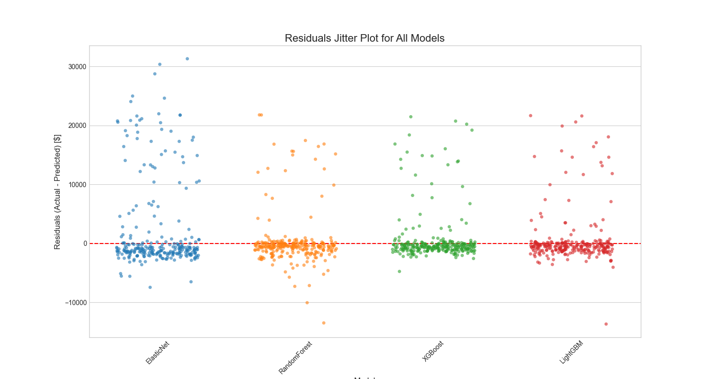
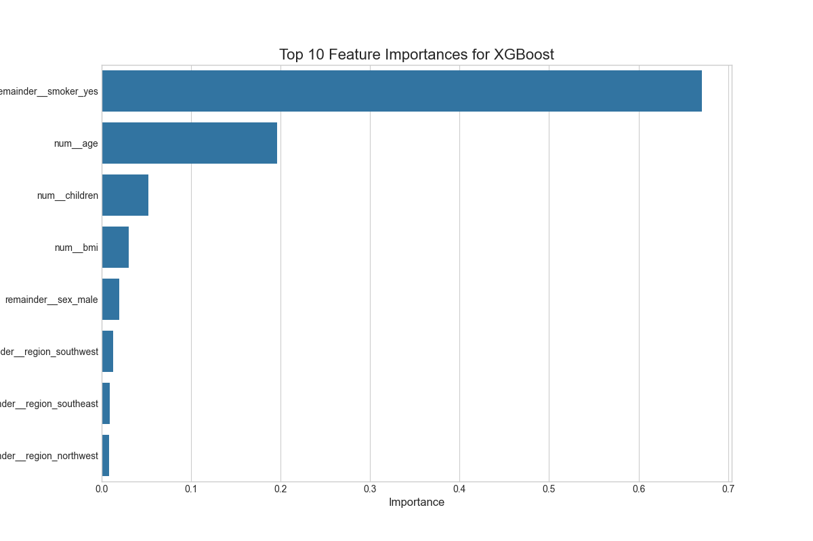

# Machine Learning Project: Medical Cost Prediction

## 1. Project Goal
The primary objective of this project is to complete a case study using open source data from Kaggle, in order to develop a machine learning model that accurately predicts individual medical costs billed by health insurance. The goal of this project is to use best practices to obtain an accurate model for our dataset.

## Table of Contents
- [Project Goal](#1-project-goal)
- [Project Workflow](#2-project-workflow)
- [Data Exploration and Preprocessing](#3-data-exploration-and-preprocessing)
- [Modeling and Hyperparameter Tuning](#4-modeling-and-hyperparameter-tuning)
- [Model Evaluation](#5-model-evaluation)
- [In-Depth Analysis of the Best Model](#6-in-depth-analysis-of-the-best-model)
- [How to Run This Project](#7-how-to-run-this-project)
- [Conclusion](#8-conclusion)

## 2. Project Workflow
This project follows a structured, end-to-end machine learning lifecycle to ensure reproducibility and robustness.

`Data Acquisition -> EDA & Preprocessing -> Modeling & Tuning -> Evaluation -> Deployment (Saving Model)`

## 3. Data Exploration and Preprocessing

### 3.1. Dataset
The project utilizes the "Medical Cost Personal Datasets" from Kaggle, containing 1,338 observations on 7 features.

### 3.2. Initial Data Analysis
Initial exploratory data analysis (EDA) involved visualizing the distributions of the key features.

**Numerical Features:** The distributions of `age`, `bmi`, and `charges` were examined. `bmi` shows a near-normal distribution, while `age` is relatively uniform. Crucially, `charges` is heavily right-skewed.


**Categorical Features:** The counts for `sex`, `smoker`, and `region` were plotted. The dataset is well-balanced for `sex` and `region`. However, there is a significant imbalance in the `smoker` category, with far more non-smokers than smokers.


### 3.3. Handling Skewness in the Target Variable
As identified in the EDA, the target variable `charges` is not normally distributed. This violates the assumptions of many regression models and can harm performance.

**Thought Process:** To mitigate this, a **log transformation** was applied. This technique compresses the range of the data, dampens the influence of extreme outliers, and makes the distribution more "normal," which is beneficial for model training. The plot below clearly shows the successful transformation from a right-skewed distribution to a more symmetric, normal-like one.


**Mathematical Formulation:** The transformation applied is $y_{new} = \log(1 + y_{old})$. The `+1` is added to handle any potential zero values in the data, as $\log(0)$ is undefined.

### 3.4. Feature Engineering: Categorical Variables
Categorical features (`sex`, `smoker`, `region`) were converted into a numerical format using **one-hot encoding**. This creates new binary columns for each category, allowing the model to interpret them.

### 3.5. Feature Scaling
The numerical features (`age`, `bmi`, `children`) exist on different scales. To prevent features with larger scales from unfairly dominating the model, **Standardization** was applied.

**Mathematical Formulation:** `StandardScaler` transforms each feature to have a mean ($\mu$) of 0 and a standard deviation ($\sigma$) of 1.

$z = \frac{(x - \mu)}{\sigma}$

## 4. Modeling and Hyperparameter Tuning

### 4.1. Building a Robust Pipeline
To ensure a clean, reproducible, and leak-proof workflow, a `scikit-learn` **Pipeline** was constructed.

**Thought Process:** Pipelines are essential for professional ML projects. They chain preprocessing steps and a model into a single object. This prevents **data leakage** (e.g., fitting the scaler on the test set) and makes the entire workflow, from raw data to prediction, easily deployable.

### 4.2. Model Selection
A diverse set of four models was chosen to compare different algorithmic approaches:
1.  **ElasticNet:** A linear model that combines L1 and L2 regularization, making it robust to feature correlation.
2.  **RandomForest:** A powerful ensemble method (bagging) that is robust and handles non-linear relationships well.
3.  **XGBoost & LightGBM:** State-of-the-art gradient boosting algorithms known for their high performance, speed, and efficiency.

### 4.3. Hyperparameter Tuning
Instead of using default parameters, **Grid Search with 5-Fold Cross-Validation (`GridSearchCV`)** was used to systematically find the optimal hyperparameters for each model.

**Thought Process:** This is a critical step to maximize model performance and prevent overfitting. By evaluating parameter combinations across multiple validation folds, we get a more reliable estimate of how the model will perform on unseen data.

## 5. Model Evaluation

### 5.1. Evaluation Metrics
The models were evaluated using three standard regression metrics:
1.  **R-squared ($R^2$)**: The proportion of the variance in the target variable that is predictable from the features. A higher value is better.
    $R^2 = 1 - \frac{\sum_{i=1}^{n}(y_i - \hat{y}_i)^2}{\sum_{i=1}^{n}(y_i - \bar{y})^2}$
2.  **Mean Absolute Error (MAE)**: The average absolute difference between the predicted and actual values. It's intuitive and measured in the original units (dollars).
    $MAE = \frac{1}{n}\sum_{i=1}^{n}|y_i - \hat{y}_i|$
3.  **Root Mean Squared Error (RMSE)**: The square root of the average of squared differences. It penalizes larger errors more heavily than MAE.
    $RMSE = \sqrt{\frac{1}{n}\sum_{i=1}^{n}(y_i - \hat{y}_i)^2}$

### 5.2. Results
The performance of the tuned models on the unseen test set is summarized below.

| Model        |   R-squared |      MAE |     RMSE |
|:-------------|------------:|---------:|---------:|
| XGBoost      |      0.8797 |  1940.29 |  4321.05 |
| RandomForest |      0.8783 |  2080.32 |  4347.55 |
| LightGBM     |      0.8747 |  2038.59 |  4410.69 |
| ElasticNet   |      0.5924 |  4428.69 |  7955.06 |

**Conclusion:** The gradient boosting models and RandomForest performed exceptionally well, significantly outperforming the baseline ElasticNet model. **XGBoost** was selected as the final model as it achieved the highest R-squared and the lowest RMSE, indicating the best overall predictive accuracy.

## 6. In-Depth Analysis of the Best Model (XGBoost)

### 6.1. Residuals Jitter Plot

This plot shows the prediction errors for all models. For a good model, we want the points to be randomly scattered around the horizontal line at 0. The XGBoost model shows one of the tightest clusters around zero, confirming its low error and unbiased predictions.

### 6.2. Feature Importance Plot

This plot reveals what features the model found most predictive.

**Key Business Insight:** The model's decisions are driven by a clear hierarchy of factors. **Being a smoker (`smoker_yes`)** is overwhelmingly the most significant predictor of medical costs, with an importance score of nearly 0.7. This is followed by **age** (around 0.2), with **number of children**, **BMI**, and **gender** having a smaller, but still noticeable, impact. This information is invaluable for an insurance company for risk assessment and underwriting.

## 7. How to Run This Project
1.  **Clone the repository:**
    ```bash
    git clone <your-repo-link>
    cd <your-repo-name>
    ```
2.  **Set up the environment:**
    ```bash
    python3 -m venv venv
    source venv/bin/activate
    pip install -r requirements.txt
    ```
3.  **Run the full training and evaluation pipeline:**
    ```bash
    python src/train_model.py
    ```
    This will generate all results, plots, and save the final model to the `models/` directory.

## 8. Conclusion
This project successfully developed a high-performance machine learning pipeline to predict medical insurance costs with an **R-squared of 0.8797**. The final XGBoost model provides accurate predictions and actionable insights, demonstrating a complete, end-to-end data science workflow from data exploration to model deployment readiness.
