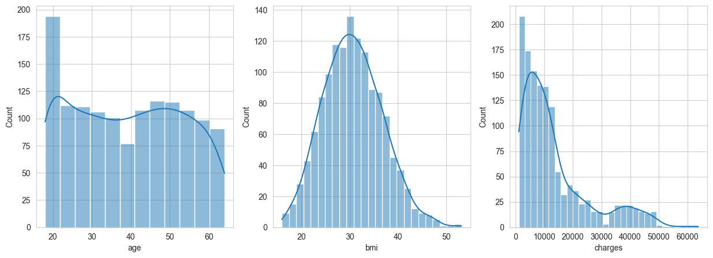
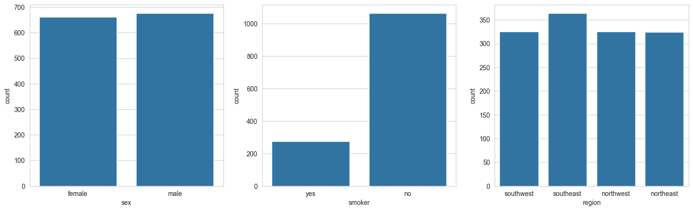
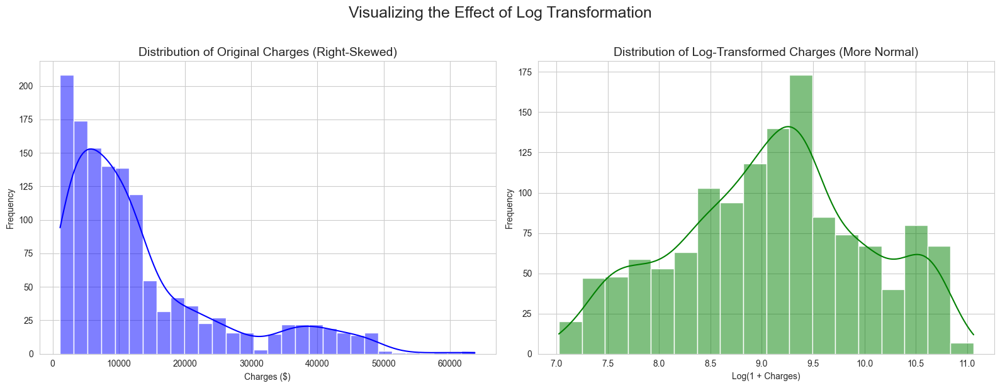
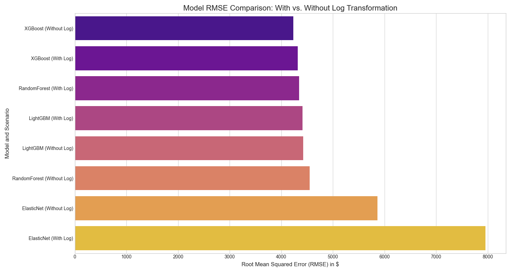
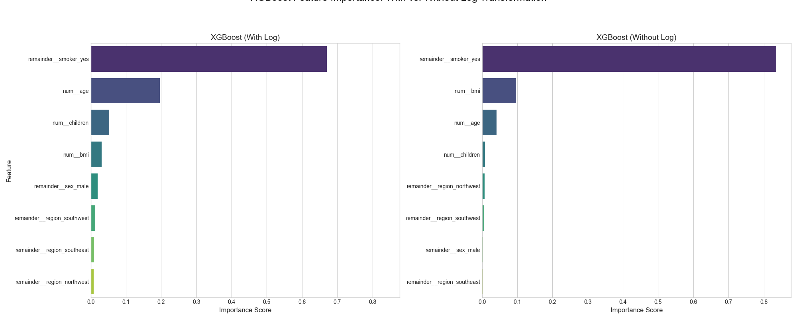
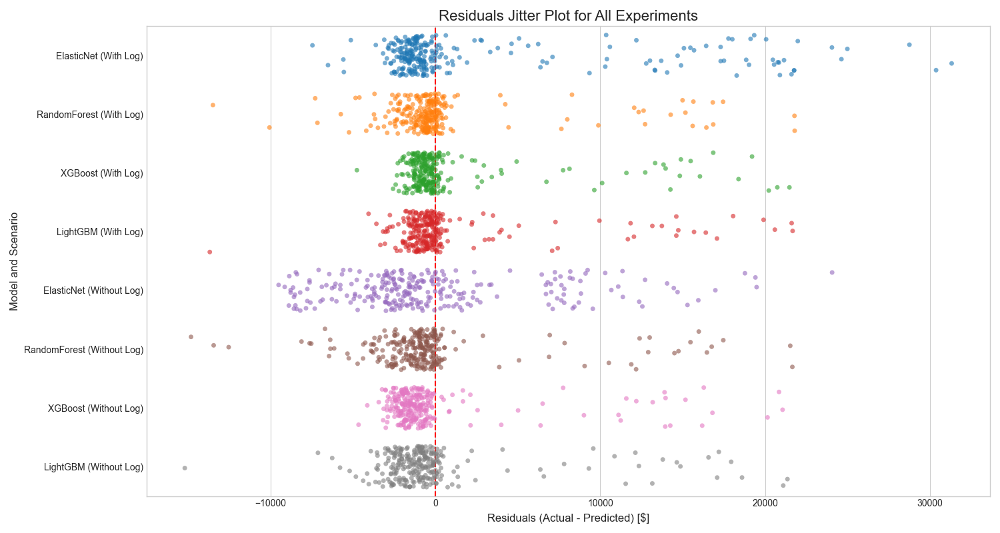

# Machine Learning Project: Medical Cost Prediction

## 1. Project Goal
The primary objective of this project is to complete a case study using open source data from Kaggle, in order to develop a machine learning model that accurately predicts individual medical costs billed by health insurance. The goal of this project is to use best practices to obtain an accurate model for our dataset.

## Table of Contents
- [Project Goal](#1-project-goal)
- [Project Workflow](#2-project-workflow)
- [Data Exploration and Preprocessing](#3-data-exploration-and-preprocessing)
- [Modeling and Hyperparameter Tuning](#4-modeling-and-hyperparameter-tuning)
- [Model Evaluation](#5-model-evaluation)
- [In-Depth Analysis and Conclusion](#6-in-depth-analysis-and-conclusion)
- [How to Run This Project](#7-how-to-run-this-project)

## 2. Project Workflow
This project follows a structured, end-to-end machine learning lifecycle to ensure reproducibility and robustness.

`Data Acquisition -> EDA & Preprocessing -> Modeling & Tuning -> Evaluation -> Deployment (Saving Model)`

## 3. Data Exploration and Preprocessing

### 3.1. Dataset
The project utilizes the "Medical Cost Personal Datasets" from Kaggle, containing 1,338 observations on 7 features.

### 3.2. Initial Data Analysis
Initial exploratory data analysis (EDA) involved visualizing the distributions of the key features.

**Numerical Features:** The distributions of `age`, `bmi`, and `charges` were examined. `bmi` shows a near-normal distribution, while `age` is relatively uniform. Crucially, `charges` is heavily right-skewed.


**Categorical Features:** The counts for `sex`, `smoker`, and `region` were plotted. The dataset is well-balanced for `sex` and `region`. However, there is a significant imbalance in the `smoker` category, with far more non-smokers than smokers.


### 3.3. Handling Skewness: A Key Hypothesis
As identified in the EDA, the target variable `charges` is not normally distributed. A common best practice for this situation is to apply a log transformation to normalize the distribution.

**Hypothesis:** Applying a log transformation to the target variable will lead to better model performance.



**Mathematical Formulation:** The transformation applied is $y_{new} = \log(1 + y_{old})$. This hypothesis was tested empirically in the modeling stage to validate its effectiveness.

### 3.4. Feature Engineering and Scaling
- **Categorical Features:** Converted to a numerical format using one-hot encoding.
- **Numerical Features:** Scaled using `StandardScaler` to put all features on a level playing field. The formula is $z = \frac{(x - \mu)}{\sigma}$.

## 4. Modeling and Hyperparameter Tuning

### 4.1. Building a Robust Pipeline
A `scikit-learn` **Pipeline** was used to chain preprocessing and modeling steps. This is a critical best practice that prevents data leakage and makes the workflow reproducible and ready for deployment.

### 4.2. Model Selection and Tuning
A diverse set of four models was chosen and tuned using **Grid Search with 5-Fold Cross-Validation (`GridSearchCV`)** to find the optimal hyperparameters for each.
1.  **ElasticNet:** A robust linear model.
2.  **RandomForest:** A powerful bagging ensemble model.
3.  **XGBoost & LightGBM:** State-of-the-art gradient boosting models.

## 5. Model Evaluation

### 5.1. The Experiment: Testing the Log Transform Hypothesis
To scientifically validate the log transform hypothesis, all four models were trained and tuned under two separate scenarios:
1.  **With Log Transform:** Predicting `log(charges)`.
2.  **Without Log Transform:** Predicting the original `charges` directly.

This resulted in 8 distinct, tuned model pipelines to compare.

### 5.2. Evaluation Metrics
Models were compared using R-squared ($R^2$), Mean Absolute Error (MAE), and Root Mean Squared Error (RMSE). RMSE was the primary metric for selecting the best model as it penalizes large errors more heavily.

### 5.3. Results
The performance of all 8 experiments on the unseen test set is summarized below.

| Experiment                 |   R-squared |      MAE |     RMSE |
|:---------------------------|------------:|---------:|---------:|
| XGBoost (Without Log)      |      0.8844 |  2452.99 |  4236.27 |
| XGBoost (With Log)         |      0.8797 |  1940.29 |  4321.05 |
| RandomForest (With Log)    |      0.8783 |  2080.32 |  4347.55 |
| LightGBM (With Log)        |      0.8747 |  2038.59 |  4410.69 |
| LightGBM (Without Log)     |      0.8738 |  2459.65 |  4425.51 |
| RandomForest (Without Log) |      0.8667 |  2524.16 |  4548.59 |
| ElasticNet (Without Log)   |      0.7786 |  4309.37 |  5862.27 |
| ElasticNet (With Log)      |      0.5924 |  4428.69 |  7955.06 |

## 6. In-Depth Analysis and Conclusion

### 6.1. Performance Analysis


**Key Finding:** The results table and the plot above reveal a crucial insight that challenges common assumptions. The powerful tree-based models, particularly **XGBoost**, were robust enough to handle the skewed data directly and achieved the best overall performance **without the log transformation**.

Counter-intuitively, the log transform significantly worsened the performance of the linear `ElasticNet` model when measured by RMSE. This is likely because small prediction errors in the log space can become very large dollar-amount errors when converted back to the original scale, which is heavily penalized by the RMSE metric. This experiment proves the critical importance of empirical testing over blindly applying "best practices."

The final model chosen is **XGBoost trained on the original, untransformed data**, as it yielded the lowest RMSE of **$4,236.27**.

### 6.2. Feature Importance Analysis


**Key Finding:** This plot compares the feature importances for the XGBoost model with and without the log transform, explaining *why* the models behave differently.
- **Without Log:** The model is heavily penalized by errors on high-cost outliers. It therefore focuses almost all its attention on `smoker_yes` (importance ~0.85), the single best predictor for these extreme cases. And making `BMI` the second most important feature (importance ~0.1).
- **With Log:** After the log transform dampens the outliers, the model can focus on improving accuracy for the general population. It still recognizes `smoker_yes` as most important (importance ~0.65), but it distributes importance more evenly, giving more weight to all other features to better differentiate between the majority of patients.

This visualization clearly shows how the model adapts its strategy based on the structure of the target variable. The most critical business insight remains consistent: **smoking status is the single most dominant factor in predicting medical costs.**

### 6.3. Residuals Analysis

This plot visualizes the prediction errors for all 8 experiments. The errors for the top-performing models are clustered around the center line at 0, indicating low bias. 
As the performance metrics of models go down we can observe a wider spread of errors.

### 6.4. Final Conclusion
This project successfully developed a machine learning pipeline to predict medical insurance costs, achieving a final **R-squared of 0.8844** with an **RMSE of 4236.27$**  on the Kaggle dataset. The experimental approach produced an accurate model but also yielded valuable insights into the robustness of different algorithms and the true impact of preprocessing steps such as using logtransform for squewed .

## 7. How to Run This Project
1.  **Clone the repository:**
    ```bash
    git clone <your-repo-link>
    cd <your-repo-name>
    ```
2.  **Set up the environment:**
    ```bash
    python3 -m venv venv
    source venv/bin/activate
    pip install -r requirements.txt
    ```
3.  **Run the full training and evaluation pipeline:**
    ```bash
    python src/train_model.py
    ```
    This will generate all results, plots, and save the final, best-performing model to the `models/` directory.
